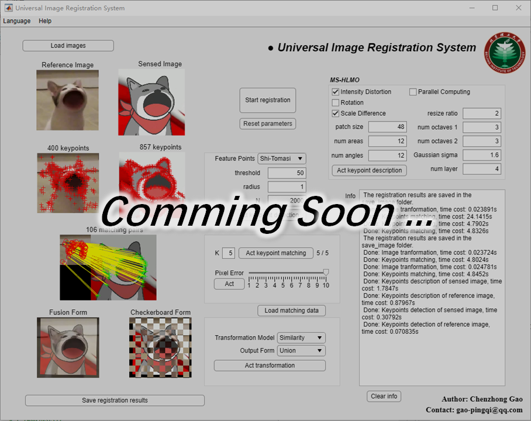
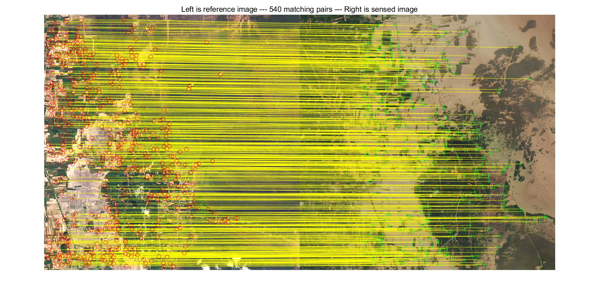
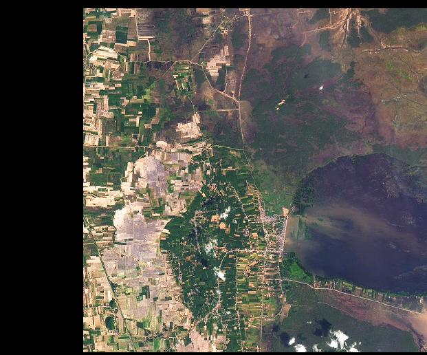
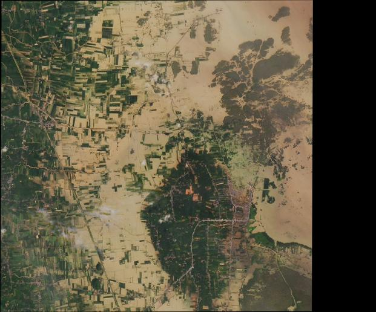
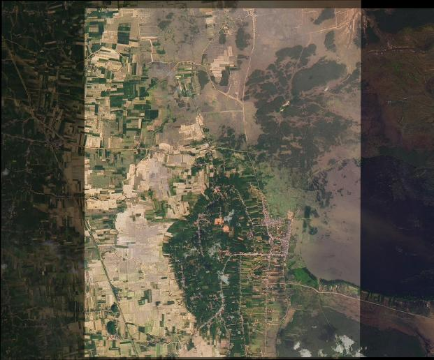
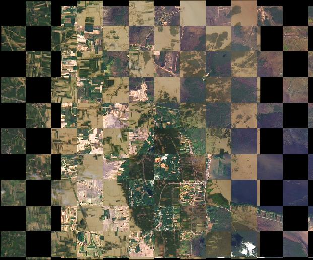

# MS-HLMO_registration

Code for the paper “MS-HLMO: Multi-scale Histogram of Local Main Orientation for Remote Sensing Image Registration” [Online]. Available: https://ieeexplore.ieee.org/document/9837033

If you have any queries or suggestions, please do not hesitate to contact me (gao-pingqi@qq.com or 3120205425@bit.edu.cn).

Run this code by the following procedures:

1. Open and run "a_registration_main.m".
2. Set the parameters, if the procedures are clearly understood. Otherwise, use the default.
3. Choose the reference image.
4. Choose the sensed image.
5. Wait for the results.

Testing data are available:

1. MSI: https://drive.google.com/file/d/1MWttUGzkOvqT7rVaqNuvoU5fXrDuD9jh/view?usp=sharing
2. HSI: https://drive.google.com/file/d/1HZo96qHkWgJtsdWeyQXNqwYf0FUv86nH/view?usp=sharing

** Now this registration algorithm is an old-fashioned one, and we highly recommend checking our updated version of MS-HLMO, which is now available at https://github.com/MrPingQi/MS-HLMO_registration-v2.0

An image registration software based on MS-HLMO:

is comming soon.

Some multi-source/multi-modal remote sensing image registration examples:
    
